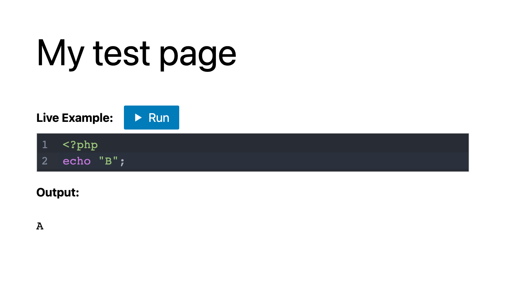

# WordPress Playground tools

This repository contains the tools and applications built using [WordPress Playground](https://developer.wordpress.org/playground/):

* Interactive Code Block for Gutenberg

If you were looking for the Playground itself, you can find it here: [WordPress Playground](https://developer.wordpress.org/playground/)



## Getting started

Clone the repo and build the projects:

```bash
git clone https://github.com/WordPress/playground-tools
cd playground-tools
npm install
npm run build
# or `npm run dev` to watch for changes
```

You'll find the built assets in the dist directory. You can make changes, install the interactive code plugin, and test them.

## Contributing

Playground Tools are in their early days. If the feature you need is missing, you are more than welcome to start a discussion, open an issue, and even propose a Pull Request to implement it.
